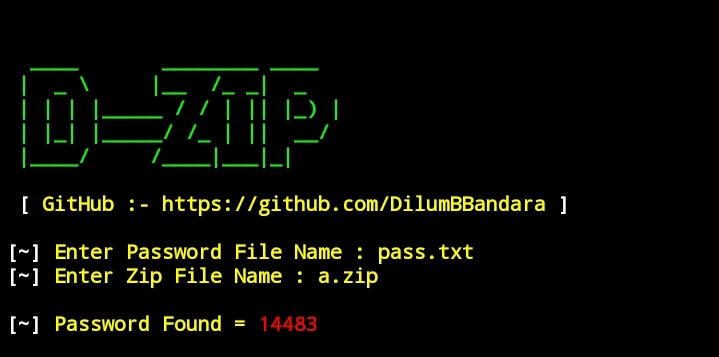

# Installation Termux
     apt update && apt upgrade -y
     apt install git python -y
     git clone https://github.com/DilumBBandara/D-Zip.git
     cd D-Zip
     python D-Zip.py

#Tested on:
   *`TERMUX`

 

